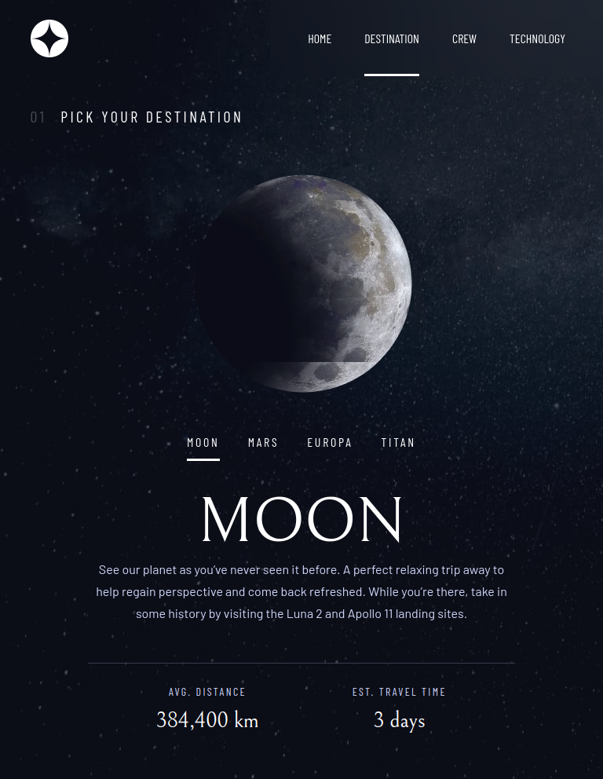

# Wanna travel to space?

A multi-page website about space tourism.
Frontend challeng by [Frontend Mentor](https://www.frontendmentor.io).

## Project Description

The multipage website was built as an SPA (Single Page Application) with react functional approach using hooks, react-router v6 for the routing betweem views, and Sass for styling of the components.

## Instructions

- Clone the repository
- Run the following command to install the required dependencies

```
npm update
```

- Run the following command to get a local version of the app

```
npm start
```

The app can be accessed at [http://localhost:3000](http://localhost:3000)

- Use the following command to bundle the app

```
npm run build
```

It correctly bundles React in production mode and optimizes the build for the best performance.

## Live version

The app can also be acessed at its [live version URL](https://space-travel101.netlify.app/destination)

## Concepts learned

- Using state, context, after effects and custom hooks.
- How to abstract away context related code and make it reusable.
- How to abstract away similar hooks code in custom hooks and make it reusable.
- Define repeated code as variables or mixins in a unique scss file and reuse it in component specific styles.
- Refactor the code to make it cleaner and easier to read.
- Advantages of react functional programming relative to class components.

## How to use

### Navigation

All views of the website will present a navigation menu. On mobile devices, a clickable menu icon will show the navigation menu. On tablets and desktop the menu will be exposed.
The website logo is clickable and will redirect the user to the homepage.

### Homepage

Upon website loading at their browser, the homepage will present a section with what the website is all about and a button that will redirect the user to the destination section to start exploring the content.

### Destination

Presents information about the destination selected. The default destination is "Moon", being the other three "Mars", "Europa" and "Titan".
The information presented are:

- Description
- Average distance
- Estimated travel time
- A picture of the destination

### Crew

Presents information about the flight crew member selected amongst the options available.

### Technology

Presents information about the technology selected amonst the options available.

## Screenshots

### mobile


### Tablet





### Desktop


